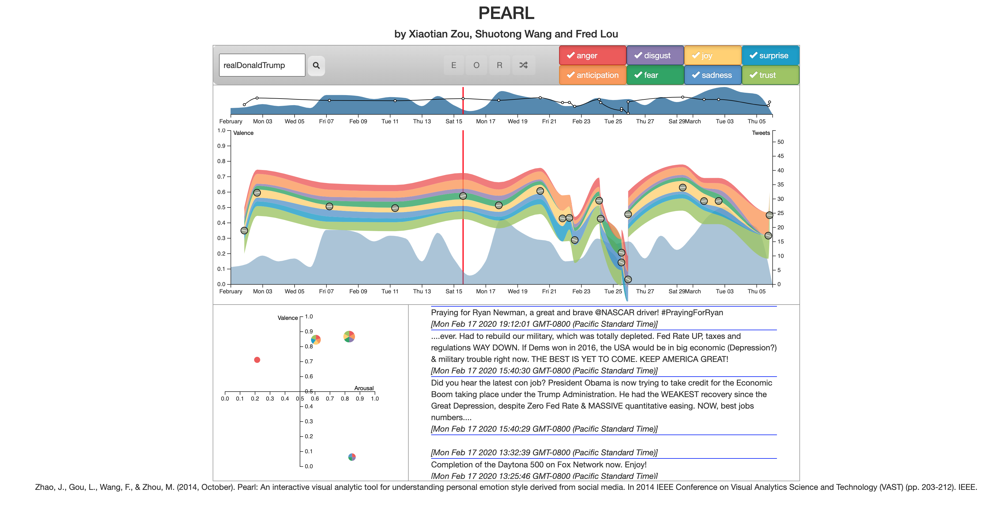

# PEARL Reimplementation

## Introduction

This is the reimplementation of PEARL: [An Interactive Visual Analytic Tool for Understanding Personal Emotion Style Derived from Social Media](https://ieeexplore.ieee.org/abstract/document/7042496?casa_token=ERvs-zLzH9YAAAAA:G3KQd5oWcz7cN_qd_F01dqOBVQh3TyuCJbzxjLGiPA5ayNCZbEnJNHC1J-blLH3xtCojuWmf_Q).

## Contributors

* Shining (Fred) Lou
* Xiaotian Zou
* Shuotong (Vincent) Wang

## Sample Screenshot

## How to Run

- Download the folder
- Enter the root directory
- Open your terminal and type 'python3 manage.py runserver'
- Open http://127.0.0.1:8000/static/html/index.html in browser, Chrome required
